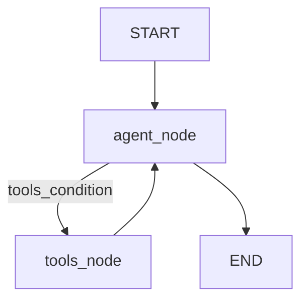

# Agentic workflow (LangGraph ReAct)

The core agent loop is implemented in [`agent/agentic_workflow.py`](../../agent/agentic_workflow.py).

## What is running

- `GraphBuilder` loads an LLM via [`utils/model_loader.py`](../../utils/model_loader.py).
- It constructs a tool list from:
  - [`tools/weather_info_tool.py`](../../tools/weather_info_tool.py)
  - [`tools/place_search_tool.py`](../../tools/place_search_tool.py)
  - [`tools/expense_calculator_tool.py`](../../tools/expense_calculator_tool.py)
  - [`tools/currency_conversion_tool.py`](../../tools/currency_conversion_tool.py)
- It binds tools to the LLM (`llm.bind_tools(...)`) and compiles a `StateGraph`.

## Graph shape

The graph is a standard ReAct pattern:

## Agent node behavior

The `agent_function`:

- takes the current `MessagesState`
- prepends the system prompt (`SYSTEM_PROMPT` from `prompt_library/prompt.py`)
- calls the tool-enabled LLM (`invoke`)
- returns the new message to the graph state

## Tool selection and termination

LangGraph’s `tools_condition` decides:

- if the last assistant message contains tool calls → route to `tools`
- else → route to `END`

This produces a loop: **agent → tools → agent** until the model stops requesting tools.

