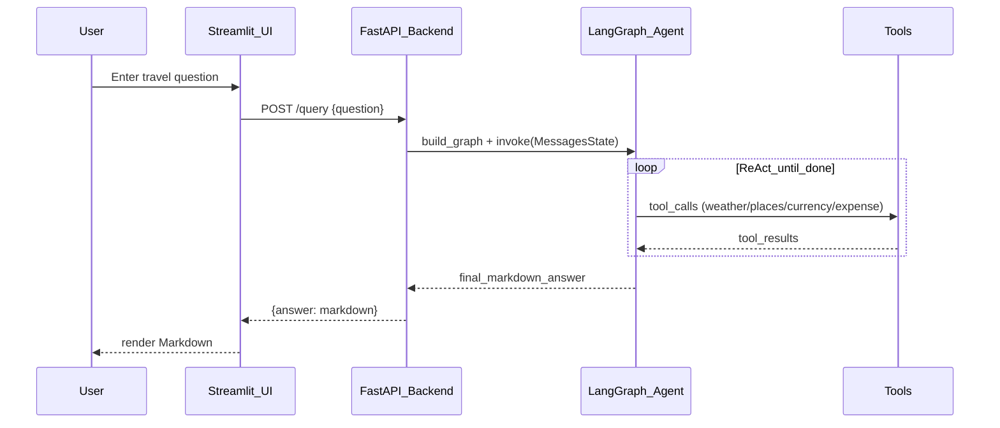

# Data flow

This document traces one request end-to-end.

## Request sequence

## Backend specifics

In [`main.py`](../../main.py):

- The endpoint instantiates `GraphBuilder(model_provider="groq")`.
- It compiles and invokes the graph with `{"messages": [query.question]}`.
- It writes a diagram image to disk:
  - `my_graph.png` is generated from `react_app.get_graph().draw_mermaid_png()`.

Operational note:

- Writing `my_graph.png` on every request is convenient for debugging, but can be noisy in production environments. If you deploy this, consider gating it behind a config flag.

