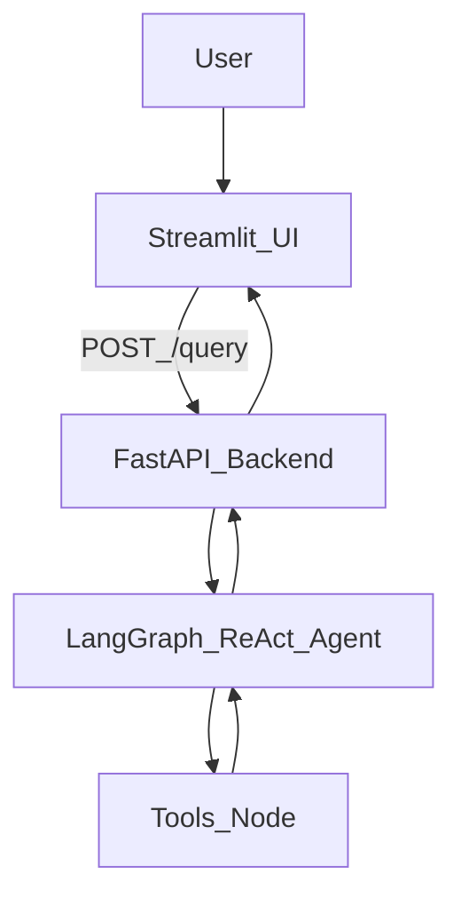

# System overview

AI Trip Planner has three layers:

- **UI**: Streamlit app (`streamlit_app.py`)
- **Backend**: FastAPI app (`main.py`)
- **Agent**: LangGraph ReAct loop (`agent/agentic_workflow.py`) calling tools (`tools/*`)

## High-level flow

## External dependencies

The agent can call tools that in turn call external APIs:

- Places: Google Places (with Tavily fallback)
- Weather: OpenWeatherMap
- Currency: ExchangeRate-API
- LLM providers: Groq or Google Gemini (see [`../reference/llm-providers.md`](../reference/llm-providers.md))

See [`tools-and-integrations.md`](tools-and-integrations.md) for details.

