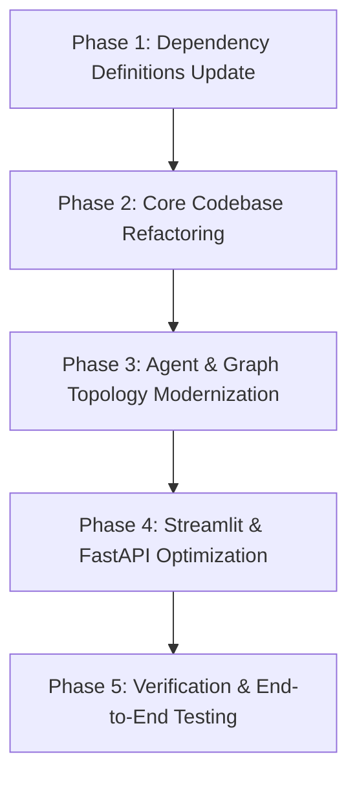

# Comprehensive Library Upgrade & Migration Implementation Plan

**Target Ecosystem:** Python >= 3.12 | LangChain 1.x LTS | LangGraph 1.2+ | Streamlit 1.62+ | FastAPI 0.141+  
**Target Date:** 2026  
**Status:** Proposed / Ready for Review  

---

## 1. Executive Summary

This document provides an end-to-end technical analysis and implementation plan for upgrading the **AI Trip Planner** project to the latest stable versions of all primary dependencies. 

The current codebase is pinned to **LangChain 0.3.x** and **LangGraph 0.6.x**. Since then, major foundational releases have been published:
- **LangChain 1.0+ LTS (currently 1.3.18):** Standardized architecture, long-term API stability, deprecation cleanups, and structured message schemas.
- **LangGraph 1.0+ (currently 1.2.11):** Production-grade durability, enhanced checkpointing, standardized agent runtime, and streamlined state handling.
- **Provider SDKs:** `langchain-google-genai` jumped from 2.x to **4.3.7** (adopting Google's unified `google-genai` SDK), `langchain-google-community` moved to **5.0.0**, `langchain-groq` reached **1.1.3**, and `langchain-openai` reached **1.6.0** (OpenAI SDK v3).
- **Web & Interface:** `fastapi` reached **0.141.1**, `streamlit` reached **1.62.0** (introducing first-class conversational chat elements and fragment streaming), and `pydantic` moved to **2.13.5**.

Upgrading ensures the project runs on active LTS versions, resolves known upstream security vulnerabilities, eliminates deprecation warnings, and unlocks major latency and user-experience optimizations.

---

## 2. Dependency Version Audit & Comparison Matrix

The table below contrasts current versions locked in `uv.lock` / `pyproject.toml` against the latest releases available on PyPI:

| Package | Current Locked Version | Latest PyPI Version | Type of Release | Primary Risk / Impact Level |
| :--- | :--- | :--- | :--- | :--- |
| **`langchain`** | `0.3.27` | **`1.3.18`** | **Major (v1.x LTS)** | ⚠️ Medium — Deprecated imports cleaned up, agent runtime shifts |
| **`langgraph`** | `0.6.6` | **`1.2.11`** | **Major (v1.x LTS)** | ⚠️ Medium — Graph edge routing validation, prebuilt updates |
| **`langchain-core`** | `0.3.75` | **`1.6.1`** | **Major (v1.x LTS)** | ⚠️ Low-Medium — Message property access (`.text` vs `.text()`) |
| **`langchain-community`** | `0.3.29` | **`0.4.2`** | Minor/Feature | ℹ️ Low — Third-party wrappers maintenance |
| **`langchain-experimental`** | `0.3.4` | **`0.4.2`** | Minor/Feature | ℹ️ Low — Maintained parity with core |
| **`langchain-google-genai`** | `2.1.10` | **`4.3.7`** | **Major (v4.x)** | ⚠️ High — Shift to unified `google-genai` SDK; dropped gRPC |
| **`langchain-google-community`** | `2.0.7` | **`5.0.0`** | **Major (v5.x)** | ⚠️ High — Places API wrapper updates and dependencies |
| **`langchain-groq`** | `0.3.7` | **`1.1.3`** | **Major (v1.x)** | ℹ️ Low — Updated underlying Groq client & reasoning support |
| **`langchain-openai`** | `0.3.32` | **`1.6.0`** | **Major (v1.x)** | ⚠️ Medium — OpenAI SDK v3 compatibility |
| **`langchain-tavily`** | `0.2.11` | **`0.2.18`** | Minor/Patch | ℹ️ Low — API parameters and stability fixes |
| **`pydantic`** | `2.11.7` | **`2.13.5`** | Minor/Patch | ℹ️ Low — `class Config` deprecation cleanup (`model_config`) |
| **`fastapi`** | `0.116.1` | **`0.141.1`** | Minor/Feature | ℹ️ Low — Starlette 1.x compatibility, lifespan handlers |
| **`streamlit`** | `1.49.1` | **`1.62.0`** | Minor/Feature | ℹ️ Low-Medium — Modern chat components & streaming APIs |
| **`uvicorn`** | `0.35.0` | **`0.52.4`** | Minor/Feature | ℹ️ Low — High-performance ASGI server updates |
| **`requests`** | `2.32.5` | **`2.34.2`** | Minor/Patch | ℹ️ Low — Security and header encoding fixes |
| **`python-dotenv`** | `1.1.1` | **`1.2.3`** | Minor/Patch | ℹ️ Low — Multiline parsing fixes |
| **`httpx`** | `0.28.1` | **`0.28.1`** | Already Latest | ℹ️ None |

---

## 3. Breaking Changes & Migration Nuances

### 3.1 LangChain 1.x (`langchain` 0.3.x ➔ 1.3.18, `langchain-core` 0.3.x ➔ 1.6.1)
- **Deprecation Purge:** All legacy modules and classes marked as deprecated in 0.2/0.3 have been removed or moved to `langchain-classic`.
- **Message Content Standardization:** `AIMessage.text` is standardized as a property rather than a callable method.
- **Agent Architecture Evolution:** LangChain 1.x designates `create_agent` as the standard agent primitive, shifting legacy helper functions to core LangGraph loops.
- **Schema Validation:** Stricter validation on tool signatures created via `@tool`. All tool arguments must specify type annotations.

### 3.2 LangGraph 1.x (`langgraph` 0.6.6 ➔ 1.2.11)
- **Graph Redundant Edge Strictness:** In `agent/agentic_workflow.py`:
  ```python
  graph_builder.add_conditional_edges("agent", tools_condition)
  graph_builder.add_edge("agent", END)  # ⚠️ REDUNDANT & CONFLICTING
  ```
  `tools_condition` already routes to `END` when the model emits no tool calls. Having an explicit static edge `add_edge("agent", END)` alongside `tools_condition` creates ambiguous branch conditions in LangGraph 1.x and must be removed.
- **Checkpointer & State Management:** Checkpointers now adhere to `langgraph-checkpoint 4.x`. If checkpointing/memory is enabled, memory savers should use the updated base protocol.

### 3.3 Google GenAI Integration (`langchain-google-genai` 2.1.x ➔ 4.3.7)
- **Unified SDK Foundation:** Deprecates `google-ai-generativelanguage` in favor of `google-genai` v2.20+.
- **Transport Mechanism:** gRPC transport is completely replaced with REST and the new Google GenAI client protocols.
- **Structured Outputs:** Default output mode for structured outputs has shifted to `method="json_schema"`.

### 3.4 Google Community & Places (`langchain-google-community[places]` 2.0.x ➔ 5.0.0)
- **Google Places API (New):** Version 5.x adapts to Google Cloud's updated Places API endpoints. The underlying wrapper requires verified environment variables (`GPLACES_API_KEY`) and respects updated place fields.

### 3.5 Pydantic (`pydantic` 2.11.x ➔ 2.13.5)
- **Deprecation of Inner `class Config`:** In `utils/model_loader.py`:
  ```python
  # Old pattern:
  class Config:
      arbitrary_types_allowed = True

  # Modern Pydantic V2.13 pattern:
  from pydantic import ConfigDict
  model_config = ConfigDict(arbitrary_types_allowed=True)
  ```
  This eliminates runtime `PydanticDeprecatedSince20` warnings.

### 3.6 Existing Codebase Bug Discovered During Audit
- **`utils/model_loader.py` Typo:**
  ```python
  elif self.model_provider == "google":
      google_api_key = os.getenv("GOOGLE_API_KEY")
      model_name = self.config["llm"]["google"]["model_name"]
      lmm = ChatGoogleGenerativeAI(model=model_name, api_key=google_api_key)  # ⚠️ typo: lmm
  return llm  # ⚠️ Raises UnboundLocalError when model_provider="google"
  ```
  Fixing this during the upgrade is essential for Google Gemini support.

---

## 4. Step-by-Step Implementation Roadmap

The upgrade is partitioned into 4 distinct, low-risk execution phases:



### Phase 1: Dependency Definitions Update
1. Update `pyproject.toml` dependencies with new version lower-bounds:
   ```toml
   dependencies = [
       "fastapi>=0.141.1",
       "httpx>=0.28.1",
       "langchain>=1.3.18",
       "langchain-community>=0.4.2",
       "langchain-experimental>=0.4.2",
       "langchain-google-community[places]>=5.0.0",
       "langchain-google-genai>=4.3.7",
       "langchain-groq>=1.1.3",
       "langchain-openai>=1.6.0",
       "langchain-tavily>=0.2.18",
       "langgraph>=1.2.11",
       "pydantic>=2.13.5",
       "python-dotenv>=1.2.3",
       "requests>=2.34.2",
       "streamlit>=1.62.0",
       "uvicorn>=0.52.4",
   ]
   ```
2. Update `requirements.txt` to keep sync for traditional `pip install` setups.
3. Regenerate lockfile using `uv lock --upgrade`.

### Phase 2: Core Codebase Refactoring
1. **`utils/model_loader.py`:**
   - Migrate `class Config` to `model_config = ConfigDict(arbitrary_types_allowed=True)`.
   - Fix the typo `lmm` ➔ `llm` in the Google provider branch.
2. **`tools/arthamatic_op_tool.py`:**
   - Verify `AlphaVantageAPIWrapper` import from `langchain_community.utilities.alpha_vantage`.
3. **`utils/place_info_search.py`:**
   - Validate `GooglePlacesTool` and `TavilySearch` invocations under new package versions.

### Phase 3: Agent & Graph Topology Modernization
1. **`agent/agentic_workflow.py`:**
   - Remove conflicting static edge `graph_builder.add_edge("agent", END)` and let `tools_condition` handle conditional routing to `END` or `tools`.
   - Add proper type hint annotations to all node functions.
   - Maintain the option to introduce `MemorySaver` checkpointer for session persistence.

### Phase 4: Streamlit & FastAPI Optimization (Optional Enhancement)
1. In `main.py`:
   - Keep singleton or cached compiled graph rather than re-compiling the StateGraph on every single request.
2. In `streamlit_app.py`:
   - Modernize chat layout to use `st.chat_message` and `st.chat_input` for enhanced UX.

### Phase 5: Verification & End-to-End Testing
1. **Smoke Tests:** Test graph compilation and image generation (`draw_mermaid_png`).
2. **Mock Tool Tests:** Run queries verifying place search, weather, and calculator tool execution.
3. **API Tests:** Verify FastAPI `/query` endpoint with `curl` or `requests`.
4. **UI Tests:** Launch Streamlit application and verify interactive prompt generation.

---

## 5. Rollback Strategy & Risk Mitigation

- **Version Control Safety:** All updates must be committed on a dedicated branch (e.g. `feat/upgrade-deps-2026`).
- **UV Deterministic Reversion:** Because `uv.lock` is tracked in git, rolling back to the exact previous environment can be achieved instantly via:
  ```bash
  git checkout main -- pyproject.toml uv.lock requirements.txt
  uv sync
  ```
- **Fallback Verification:** The built-in Tavily fallback in `PlaceSearchTool` ensures that even if Google Places API credentials or quota fail, queries continue resolving.
