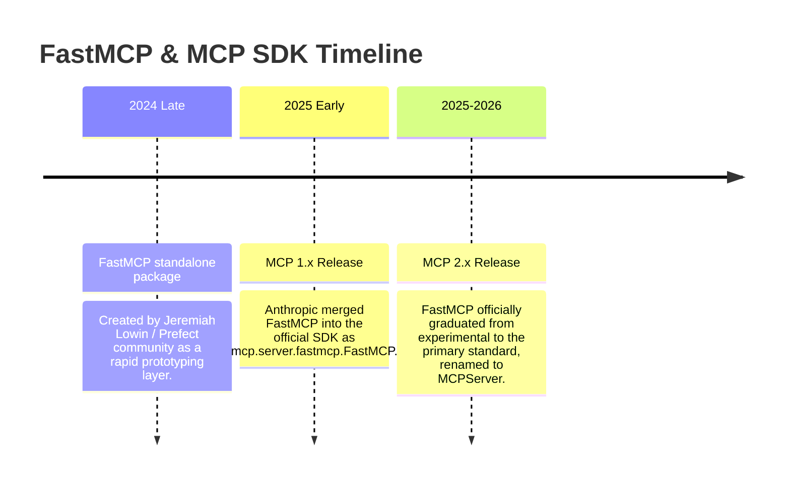

# FastMCP vs. Core MCP SDK: Comprehensive Guide & Architectural Comparison

**Topic:** Model Context Protocol (MCP) Python Ecosystem  
**Target Audience:** AI Engineers, Backend Developers, and Framework Architects  
**Scope:** Differences, history, architectural layers, migration from v1 to v2, and best practices  

---

## 1. Executive Overview

When building applications or agents that integrate with the **Model Context Protocol (MCP)**, developers frequently encounter references to both **`mcp`** (the official Python SDK) and **`FastMCP`**.

Understanding the distinction is best framed through a familiar web development analogy:

> **Analogy:**  
> - **Core `mcp` (Low-Level SDK)** is like **ASGI / Starlette**: It defines the foundational protocol, handles raw JSON-RPC 2.0 framing, transport sockets (`stdio`, `sse`), lifecycle state machines, and low-level message serialization.
> - **`FastMCP` (High-Level Server)** is like **FastAPI**: It sits on top of the core protocol engine, using Python type hints, function docstrings, and decorator semantics (`@tool`, `@resource`, `@prompt`) to eliminate boilerplate and automate schema generation.

---

## 2. Conceptual & Architectural Differences

```
┌────────────────────────────────────────────────────────────────────────┐
│                        AI Client / IDE Layer                           │
│             (Claude Desktop, Cursor, Antigravity, Copilot)             │
└───────────────────────────────────┬────────────────────────────────────┘
                                    │ JSON-RPC 2.0 (stdio / SSE)
                                    ▼
┌────────────────────────────────────────────────────────────────────────┐
│                       High-Level Framework Layer                       │
│     FastMCP (mcp 1.x) / MCPServer (mcp 2.x)                            │
│     - Automatic JSON Schema generation from type hints                 │
│     - Automatic docstring parsing for tool descriptions                │
│     - Automatic dispatch, serialization, and error wrapping            │
│     - Decorators: @tool, @resource, @prompt                            │
└───────────────────────────────────┬────────────────────────────────────┘
                                    │
                                    ▼
┌────────────────────────────────────────────────────────────────────────┐
│                        Core Protocol Engine                            │
│     mcp.server.lowlevel.Server (Core SDK)                              │
│     - Protocol handshake & capability negotiation                      │
│     - Raw JSON-RPC 2.0 message parsing & serialization                 │
│     - Transport adapters: StdioServerTransport, SseServerTransport     │
│     - Primitive types: Tool, TextContent, Resource, PromptMessage      │
└────────────────────────────────────────────────────────────────────────┘
```

---

## 3. Side-by-Side Code Comparison

To understand the difference in developer experience, consider building a simple weather tool:

### Approach A: Low-Level Core `mcp` (Manual Protocol Plumbing)

With low-level `mcp`, you must write the JSON Schema dictionaries by hand, maintain an explicit list of tools, write a custom dispatcher with `if/else` checks, and wrap outputs manually into protocol objects:

```python
# Low-Level Core MCP (mcp.server.lowlevel.Server)
import asyncio
from mcp.server.lowlevel import Server
from mcp.server.stdio import stdio_server
import mcp.types as types

app = Server("weather-server")

# 1. Manually declare tools and manual JSON Schema dictionaries
@app.list_tools()
async def list_tools() -> list[types.Tool]:
    return [
        types.Tool(
            name="get_weather",
            description="Get current temperature for a city",
            inputSchema={
                "type": "object",
                "properties": {
                    "city": {
                        "type": "string",
                        "description": "Name of the target city"
                    },
                    "celsius": {
                        "type": "boolean",
                        "description": "Whether to return Celsius",
                        "default": True
                    }
                },
                "required": ["city"]
            }
        )
    ]

# 2. Manually route, extract arguments, and wrap text responses
@app.call_tool()
async def call_tool(name: str, arguments: dict) -> list[types.TextContent]:
    if name == "get_weather":
        city = arguments.get("city")
        celsius = arguments.get("celsius", True)
        temp = 24 if celsius else 75
        unit = "C" if celsius else "F"
        
        return [
            types.TextContent(
                type="text",
                text=f"Weather in {city}: {temp}°{unit}"
            )
        ]
    raise ValueError(f"Unknown tool: {name}")

# 3. Manually wire transport lifecycle
async def main():
    async with stdio_server() as (read_stream, write_stream):
        await app.run(read_stream, write_stream, app.create_initialization_options())

if __name__ == "__main__":
    asyncio.run(main())
```

### Approach B: High-Level `FastMCP` / `MCPServer` (Type-Driven)

With FastMCP, the exact same functionality requires only **5 lines of standard Python code**. Type hints generate the JSON Schema, the docstring generates tool and parameter descriptions, and the return value is automatically packaged into the protocol:

```python
# High-Level FastMCP / MCPServer (mcp.server.mcpserver.MCPServer)
from mcp.server.mcpserver import MCPServer

mcp = MCPServer("weather-server")

@mcp.tool()
def get_weather(city: str, celsius: bool = True) -> str:
    """
    Get current temperature for a city.

    Args:
        city: Name of the target city.
        celsius: Whether to return Celsius (default True).
    """
    temp = 24 if celsius else 75
    unit = "C" if celsius else "F"
    return f"Weather in {city}: {temp}°{unit}"

if __name__ == "__main__":
    mcp.run(transport="stdio")
```

---

## 4. Feature Comparison Matrix

| Capability | Low-Level `mcp.server.Server` | `FastMCP` (v1) / `MCPServer` (v2) |
| :--- | :--- | :--- |
| **Tool Declaration** | Manual `types.Tool(...)` instantiation | Python decorator `@mcp.tool()` |
| **JSON Schema Generation** | Manual handwritten JSON schema dicts | **Automatic** from Python type annotations |
| **Argument Validation** | Manual inspection in handler | **Automatic** before function invocation |
| **Tool Dispatching** | Manual `if/elif` string routing | **Automatic** by function name |
| **Return Type Packaging** | Must return `list[types.TextContent]` | Return `str`, `dict`, `int`, or Pydantic models directly |
| **Resource Support** | Manual URI pattern routing | Decorator `@mcp.resource("uri://{param}")` |
| **Prompt Template Support** | Manual prompt message construction | Decorator `@mcp.prompt()` |
| **Transport Lifecycle** | Must manage stream contexts & options | Built-in `.run(transport="stdio")` or `.sse_app()` |
| **Code Lines (Approx.)** | ~50–80 lines for 3 tools | ~15–25 lines for 3 tools |
| **Recommended Usage** | Custom proxy gateways, protocol extensions | **Application backends, agent tools, domain APIs** |

---

## 5. History & The Evolution from v1 to v2

Developers often wonder why import statements differ between online tutorials and current codebases. Here is the historical timeline:



### The 3 Evolutionary Stages

1. **Standalone `fastmcp` (Early 2025)**:
   - Installed via `pip install fastmcp`.
   - Independent open-source helper library.

2. **Official Submodule in `mcp` 1.x (`mcp.server.fastmcp`)**:
   - Anthropic incorporated FastMCP into the standard `mcp` package.
   - Import syntax:
     ```python
     from mcp.server.fastmcp import FastMCP
     mcp = FastMCP("My Server")
     ```

3. **Standard Core in `mcp` 2.x (`mcp.server.mcpserver`) — Current State**:
   - In MCP SDK 2.x, the class was graduated to the first-class server type and renamed to **`MCPServer`**:
     ```python
     from mcp.server.mcpserver import MCPServer
     mcp = MCPServer("My Server")
     ```
   - If you attempt `from mcp.server.fastmcp import FastMCP` in `mcp>=2.0.0`, the package raises a descriptive `ModuleNotFoundError` guiding you to `from mcp.server.mcpserver import MCPServer`.
   - All decorator patterns (`@mcp.tool()`, `@mcp.resource()`, `@mcp.prompt()`) remain identical.

---

## 6. How Our AI Trip Planner Uses This Architecture

In this repository, we deliberately utilize **`MCPServer` (FastMCP 2.x)**:

1. **Atomic Domain Tools ([mcp_server/tools_atomic.py](file:///c:/Users/adity/Documents/langgraph/ai_trip_planner/mcp_server/tools_atomic.py))**:
   - Functions like `get_destination_weather`, `search_destination_attractions`, and `calculate_trip_budget` are pure Python functions with standard type hints and detailed docstrings.
   - `MCPServer` in [mcp_server/server.py](file:///c:/Users/adity/Documents/langgraph/ai_trip_planner/mcp_server/server.py) decorates them directly:
     ```python
     @mcp.tool()
     def get_weather(city: str, forecast: bool = True) -> str:
         """Get current weather conditions and 5-day forecast for any travel destination."""
         return get_destination_weather(city=city, forecast=forecast)
     ```

2. **Autonomous Agent Meta-Tools ([mcp_server/tools_agent.py](file:///c:/Users/adity/Documents/langgraph/ai_trip_planner/mcp_server/tools_agent.py))**:
   - `plan_trip` and `refine_trip` execute the entire LangGraph ReAct agent loop in a single tool call.
   - `MCPServer` validates arguments (`destination: str`, `days: int`), executes the asynchronous agent graph, and returns clean Markdown.

3. **Zero Redundant Boilerplate**:
   - No handwritten JSON schemas.
   - No manual message serialization.
   - 100% compliant with Claude Desktop, Cursor, and Antigravity IDE specifications.

---

## 7. Key Takeaways & Recommendations

1. **For 95% of Applications**: Use **`MCPServer`** (formerly FastMCP). It is faster to write, easier to maintain, auto-documents itself via docstrings, and prevents schema synchronization bugs.
2. **For Advanced Gateway Infrastructure**: Use low-level **`mcp.server.lowlevel.Server`** only if you are building dynamic protocol forwarders, reverse proxies, or custom non-standard transports where functions cannot be statically defined.
