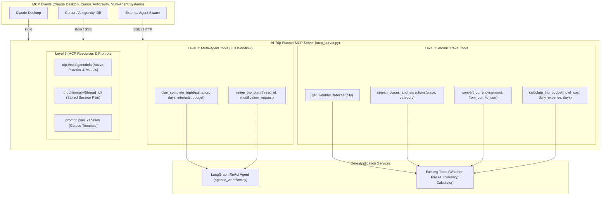
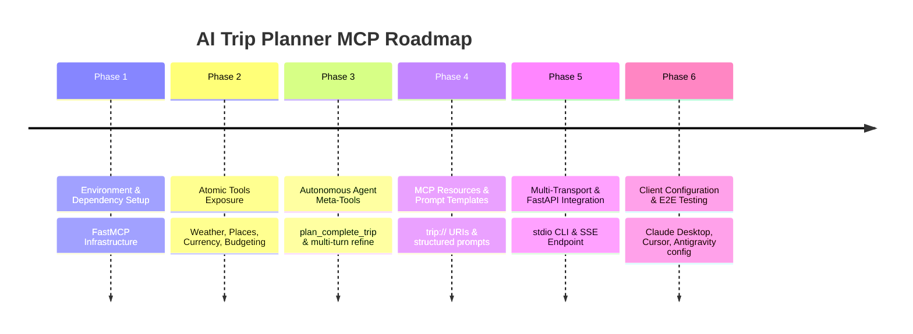

# Multi-Phase Implementation Plan: Exposing AI Trip Planner as an MCP Server

**Project:** AI Trip Planner  
**Protocol:** Model Context Protocol (MCP) Specification (Anthropic / Open Standard)  
**SDK:** Python `mcp` >= 2.1.1 (`FastMCP` standard)  
**Supported Transports:** `stdio` (Desktop AI IDEs: Claude Desktop, Cursor, Antigravity) & `SSE` / Stream (Remote Web / Microservices)  
**Status:** Proposed Architecture & Phase Roadmap  

---

## 1. Executive Summary & Vision

### Why Expose AI Trip Planner as an MCP Server?
Currently, AI Trip Planner is accessible via a Streamlit web application and FastAPI REST endpoints. By wrapping and exposing its capabilities as an **MCP (Model Context Protocol) Server**, any MCP-compatible AI client—such as **Claude Desktop, Cursor, Antigravity, VS Code Copilot, or external LangGraph / multi-agent systems**—can directly and natively:
1. **Call the Trip Planner Agent as an Autonomous Meta-Tool** (`plan_complete_trip`, `refine_trip_plan`).
2. **Access Granular Travel Domain Tools** individually (`get_current_weather`, `get_weather_forecast`, `search_attractions`, `search_restaurants`, `search_activities`, `convert_currency`, `estimate_hotel_cost`).
3. **Inspect Resources & Prompts** (e.g. read the system travel guidelines via `trip://prompts/system`, inspect live exchange rates, or preview destination guides as dynamic MCP resources).

---

## 2. Architecture & Exposure Patterns

We will offer a **Hybrid Exposure Model**:



### Transport Mechanisms
1. **`stdio` Transport (Local Desktop Integration)**:
   - Primary transport for local development and IDEs (Cursor, Claude Desktop, Antigravity).
   - Launched via `python mcp_server.py` or `.venv/Scripts/python mcp_server.py`.
2. **`SSE` (Server-Sent Events) Transport (Network / Remote Integration)**:
   - Can be mounted directly inside our existing FastAPI backend ([main.py](file:///c:/Users/adity/Documents/langgraph/ai_trip_planner/main.py)) under `/mcp/sse`, allowing both regular REST/Streamlit and remote MCP connections simultaneously.

---

## 3. Detailed Multi-Phase Implementation Roadmap



### Phase 1: Environment & Dependency Setup
**Goal:** Add official Python `mcp` SDK to the project dependencies and set up the foundation.
- **Tasks**:
  1. Add `mcp>=2.1.1` to [pyproject.toml](file:///c:/Users/adity/Documents/langgraph/ai_trip_planner/pyproject.toml) and [requirements.txt](file:///c:/Users/adity/Documents/langgraph/ai_trip_planner/requirements.txt).
  2. Run `uv lock` and `uv sync` to install `mcp` into `.venv`.
  3. Create directory `mcp_server/` with `__init__.py` to house server modules cleanly.

---

### Phase 2: Atomic Domain Tools Exposure
**Goal:** Wrap all existing specialized travel tools as first-class MCP tools with typed schemas, rich docstrings, and robust error handling.
- **Target Tools to Expose**:
  - `get_destination_weather(city: str, forecast: bool = True)`: Wraps `WeatherInfoTool` (current weather + multi-day forecast).
  - `search_destination_attractions(place: str)`: Wraps `PlaceSearchTool` attractions search (Google Places with Tavily fallback).
  - `search_destination_restaurants(place: str)`: Wraps `PlaceSearchTool` dining & eatery discovery.
  - `search_destination_activities(place: str)`: Wraps `PlaceSearchTool` outdoor/adventure activities.
  - `convert_travel_currency(amount: float, from_currency: str, to_currency: str)`: Wraps `CurrencyConverterTool`.
  - `calculate_trip_budget(price_per_night: float, total_days: int, estimated_daily_cost: float)`: Wraps `CalculatorTool`.
- **Implementation Highlights**:
  - Use `FastMCP("AI Travel Planner")` tool decorators:
    ```python
    @mcp.tool()
    def get_destination_weather(city: str, forecast: bool = True) -> str:
        """Fetch current weather and 5-day forecast for any travel destination."""
        ...
    ```
  - Return clean markdown/JSON strings easily readable by any LLM.

---

### Phase 3: High-Level Autonomous Meta-Tools
**Goal:** Expose the full LangGraph ReAct workflow as an intelligent, autonomous MCP tool.
- **Target Meta-Tools**:
  - `plan_complete_trip(destination: str, days: int, budget: Optional[str] = None, preferences: Optional[str] = None, model_provider: str = "google") -> str`:
    - Generates a full day-by-day itinerary (morning/afternoon/evening), dual classic + off-beat plans, live weather, hotel estimates, and currency-converted budget breakdown.
    - Creates or registers a session `thread_id` so the user can follow up.
  - `refine_trip_plan(thread_id: str, modification_request: str) -> str`:
    - Leverages LangGraph 1.2's `MemorySaver` checkpointer using the existing `thread_id` to adjust specific days, re-budget, or change activities without starting from scratch.

---

### Phase 4: MCP Resources & Prompt Templates
**Goal:** Provide contextual resources and pre-configured prompt workflows to client LLMs.
- **MCP Resources**:
  - `trip://system/status`: Returns current server health, configured providers (`google`, `groq`), and active models (`gemini-2.5-flash`, `llama-3.3-70b-versatile`).
  - `trip://itinerary/{thread_id}`: Returns stored conversation messages and plan history for any active session.
- **MCP Prompt Templates**:
  - `prompt://plan_vacation`: Guided user prompt collecting destination, duration, party size, budget level, and dietary/activity preferences.
  - `prompt://budget_calculator`: Guided prompt for financial breakdown of accommodation, travel, food, and emergency buffer.

---

### Phase 5: Dual-Transport Integration (stdio + FastAPI SSE)
**Goal:** Allow running the MCP server both locally via terminal/stdio and remotely over HTTP/SSE.
- **1. Standalone CLI (`mcp_server/cli.py` or `python -m mcp_server`)**:
  - Runs with `mcp.run(transport="stdio")`.
  - Ideal for Claude Desktop, Cursor, Antigravity.
- **2. FastAPI SSE Mount**:
  - Mount MCP server routes inside [main.py](file:///c:/Users/adity/Documents/langgraph/ai_trip_planner/main.py) using `mcp.sse_app()`.
  - Enables web clients and distributed microservices to connect to the MCP server over HTTP/SSE.

---

### Phase 6: Client Configuration, Documentation & End-to-End Verification
**Goal:** Document integration guides and verify server operation with standard MCP test utilities.
- **Integration Guides**:
  - **Claude Desktop Configuration** (`claude_desktop_config.json` snippet):
    ```json
    {
      "mcpServers": {
        "ai-trip-planner": {
          "command": "uv",
          "args": ["run", "--directory", "C:\\Users\\adity\\Documents\\langgraph\\ai_trip_planner", "python", "-m", "mcp_server"]
        }
      }
    }
    ```
  - **Cursor / Antigravity IDE Configuration** (`mcp.json` snippet).
- **Verification Plan**:
  - Run MCP Inspector (`npx @modelcontextprotocol/inspector`) to visually verify tool execution, schemas, and resource reads.
  - Test `stdio` invocation with synthetic JSON-RPC messages.
  - Test tool execution in isolation and end-to-end trip generation.

---

## 4. File Structure for Proposed MCP Implementation

```
ai_trip_planner/
├── mcp_server/
│   ├── __init__.py               # Package initializer
│   ├── server.py                 # FastMCP instance definition & tool bindings
│   ├── tools_atomic.py           # Wrappers for weather, places, currency, budget
│   ├── tools_agent.py            # Wrappers for plan_complete_trip & refine_trip_plan
│   ├── resources.py              # Dynamic MCP resources & templates
│   └── __main__.py               # CLI entrypoint for stdio transport
├── docs/
│   └── mcp-server/
│       ├── mcp-server-guide.md   # Setup, connection, and API usage
│       └── client-configs.md     # Ready-to-copy JSON configs for Claude & Cursor
├── main.py                       # (Optionally mounted with /mcp SSE endpoint)
├── pyproject.toml                # Updated with mcp>=2.1.1
└── requirements.txt              # Updated with mcp>=2.1.1
```

---

## 5. Value & Benefits Realized

1. **Ecosystem Interoperability**: AI Trip Planner transforms from a standalone app into an open travel capability callable from Claude, Cursor, Antigravity, ChatGPT (via MCP bridge), and multi-agent systems.
2. **Dual Usage**: Users can still use the Streamlit UI and FastAPI endpoints as normal; MCP runs in parallel without breaking changes.
3. **Multi-turn Continuity**: LLM clients can maintain persistent conversation state across turns via `thread_id` and LangGraph checkpointers.
